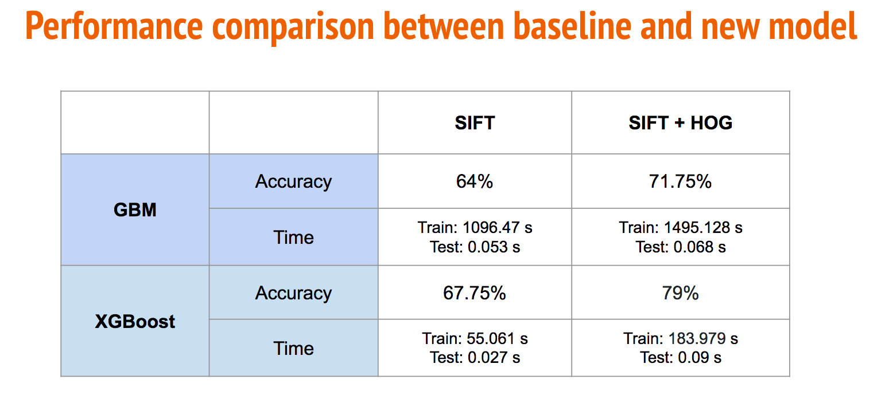
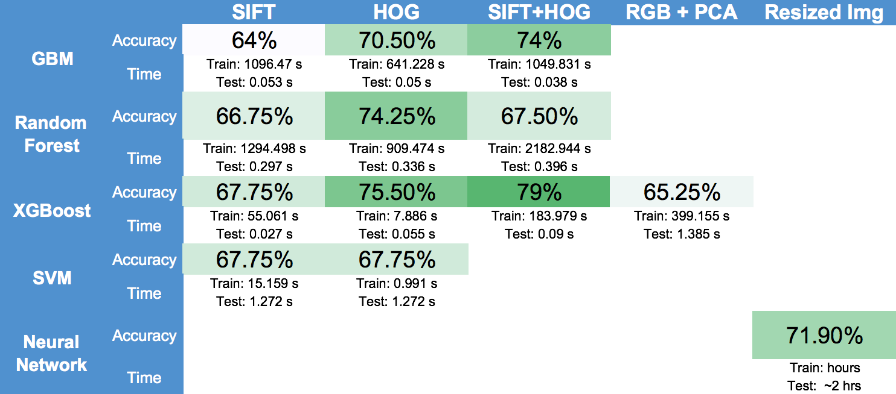

# Spring 2018


# Project 2: Image Classification - Predictive Modelling

----


### [Project Description](doc/)

Term: Spring 2018

+ Project title: Cats :cat2: or Dogs :dog2: ?
+ Team Number: 5
+ Team Members:
  + Ginny Gao
  + Sile Yang
  + Juho Ma
  + Chris Lai
  + Noah Chasek-Macfoy
                
+ Project summary: In this project, we extracted features of cats and dogs, explored and compared various classification models to detect whether an image shows a cat or dog.

 + Baseline model: GBM with SIFT features
   
 + Proposed model: XGBoost with SIFT + HoG features, Convolutional Neural Network 

+ Project details: We explored different feature extraction methods, including as SIFT, HoG, SIFT + HoG, RGB + PCA, and SIFT + HoG + RGB + PCA. We also tested different classification models to select a model that achieves best performance, from algorithm accuracy, runtime, and memory perspective. Please refer to our [`main.Rmd`](https://github.com/GU4243-ADS/project-2-predictive-modelling-group-5/blob/master/doc/main.Rmd) for more details. For the efficiency of computation and the improved accuracy, we chose XGBoost classier with SIFT + HoG features, which increased the accuracy over the baseline from 64% to 79% and decreased the training runtime from a the baseline of 1096.47s down to 183.979s.

  + Performance comparsion between baseline and advanced model  
  
  
  + Performance comparison across different features and models explored  
  

+ CNN architecture. 
Convolution is a mathematical operation that’s used in single processing to filter signals, find patterns in signals.    
In cnn, we used `tf.nn.conv2d` to create 3 convolutional layers (one is gray). For prediction and optimization, we use `session.run()` to calculate accuracy. Function `print_accuracy` is a function for printing the classification accuracy on the test set.    
More details can be found [here](https://github.com/GU4243-ADS/project-2-predictive-modelling-group-5/blob/master/lib/cnn.ipynb).


Contribution statement: [default](doc/a_note_on_contributions.md) All team members contributed equally in all stages of this project. All team members approve our work presented in this GitHub repository including this contributions statement.


Following [suggestions](http://nicercode.github.io/blog/2013-04-05-projects/) by [RICH FITZJOHN](http://nicercode.github.io/about/#Team) (@richfitz). This folder is orgarnized as follows.

```
proj/
├── lib/
├── data/
├── doc/
├── figs/
└── output/
```

Please see each subfolder for a README file.
